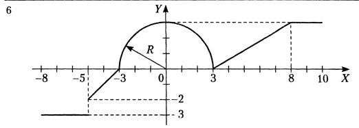

# Практическая работа №1
## Задание
Разветвляющиеся вычислительные процессы.
Вычисление значения функции. Написать программу, которая по введенному значению аргумента вычисляет
значение функции, заданной в виде графика. Параметр Р вводится с клавиатуры.

